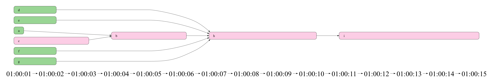

## SLA tracker based on longest paths

This script lets the user visualise and extract the longest path of a task in a DAG


## How to

First, install the needed dependencies
```commandline
poetry install
```

This library uses graphviz to render the final graph, if you want to use this functionality you should have graphviz in your system:
```commandline
brew install graphviz
```


### Get the critical path of a model:

```commandline
poetry run python main.py --model i
```
This will produce the critical path for the previous date of the run:
```commandline
entity    start_time           end_time               duration  
--------  -------------------  -------------------  ----------  
c         2023-06-01 01:00:00  2023-06-01 01:00:03           3  
b         2023-06-01 01:00:03  2023-06-01 01:00:06           3  
h         2023-06-01 01:00:06  2023-06-01 01:00:10           4  
i         2023-06-01 01:00:10  2023-06-01 01:00:15           5  
```


# Support for multiple inputs
This script has support to read dbt manifest/runtime files
